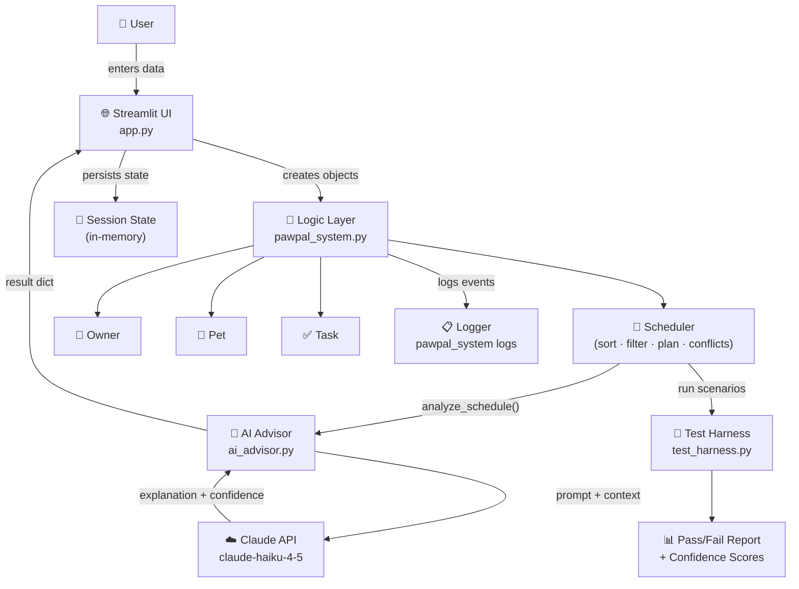

# PawPal+ System Architecture

> Export this diagram as a PNG using [Mermaid Live Editor](https://mermaid.live) and save as `architecture.png` in this folder.

## Data Flow Summary

1. **User** enters owner/pet/task info in the Streamlit UI
2. **UI** creates `Owner`, `Pet`, `Task` objects and stores them in session state
3. **Scheduler** sorts, filters, and plans tasks using priority + time logic
4. When user clicks **Get AI Analysis**, `ai_advisor.py` sends the plan + pet health context to Claude
5. **Claude** (haiku model) returns an explanation, health flags, and confidence score
6. **Test Harness** can be run independently to evaluate scheduler reliability across 6 scenarios

## Components

| Component | File | Role |
|---|---|---|
| Streamlit UI | `app.py` | User-facing interface, session state management, guardrails |
| Logic Layer | `pawpal_system.py` | Task/Pet/Owner/Scheduler classes with logging |
| AI Advisor | `ai_advisor.py` | Agentic reasoning — sends schedule to Claude, parses response |
| Test Harness | `test_harness.py` | Automated evaluation: 6 scenarios, pass/fail + confidence |
| Unit Tests | `tests/test_pawpal.py` | 25 pytest tests covering all scheduler behaviors |
